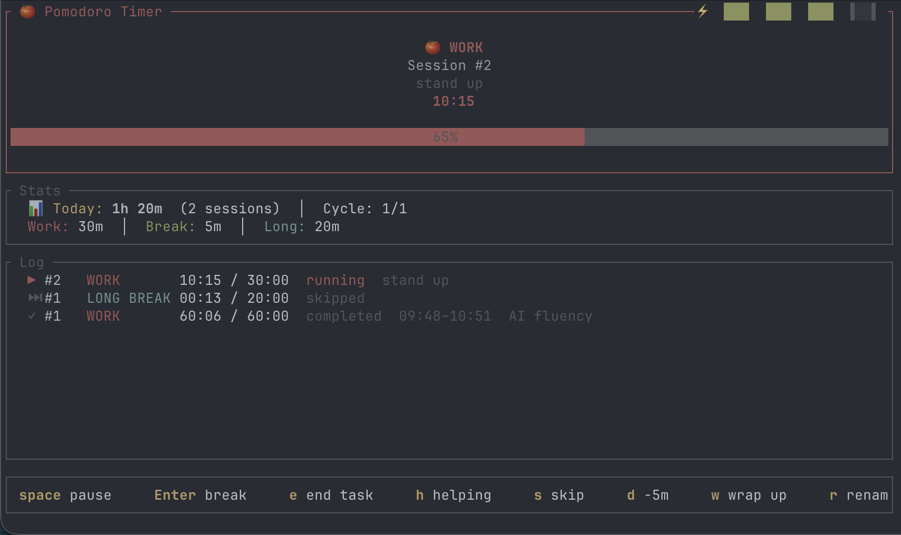

# rustodoro 🦀🍅

A terminal Pomodoro timer written in Rust. Keep focus without leaving the terminal — with automatic daily logs, a todo list, and native desktop notifications.



## Features

- Pomodoro timer with configurable work, short break, and long break durations
- Task tracking — pick from a todo list or type a custom task
- Todo list — add, edit, delete, and check off tasks in-app
- Daily logs — sessions appended to quarterly markdown files (`YYYY-Q?.md`)
- Sleep-aware — detects when your machine sleeps mid-session
- Manual breaks — take an open-ended break between sessions
- Helping mode — track time spent helping others separately
- Distraction button (`d`) — add 5 minutes of paused time
- Early end with notes (`e`) — end a session early and record what you did
- Desktop notifications on macOS (via `terminal-notifier`)
- Energy bar showing hours logged today

## Installation

### Homebrew (planned)

```sh
brew install rustodoro
```

### From crates.io

```sh
cargo install rustodoro
```

### From source

Requires Rust 1.85+ (2024 edition).

```sh
git clone https://github.com/alvisf/rustodoro.git
cd rustodoro
cargo install --path .
```

### Optional: desktop notifications on macOS

```sh
brew install terminal-notifier
```

Without `terminal-notifier`, the timer still works — you just won't get system notifications.

## First run

On first launch you'll see an onboarding screen asking where to save your daily logs. The default is `~/Documents/Notes/daily-logs`. Press **Enter** to accept or type a different path. `~` expands to your home directory, and missing directories are created automatically.

Your choice is saved to `~/.config/rustodoro/config` (respects `$XDG_CONFIG_HOME`).

## Usage

```sh
rustodoro
```

The app opens on your todo list. Pick a task with **Enter**, or press **n** for a custom task. Adjust work/break durations on the setup screen, then **Enter** to start the timer.

## Keyboard shortcuts

Arrow keys and `hjkl` are both supported for navigation.

### Onboarding

| Key | Action |
|---|---|
| `Enter` | Confirm log directory |
| `Ctrl+R` | Reset to default |
| `Esc` | Quit |

### Todo list

| Key | Action |
|---|---|
| `↑↓` / `jk` | Move cursor |
| `Enter` | Start timer (picker) / toggle done (manager) |
| `Space` | Toggle done |
| `a` | Add todo |
| `e` | Edit todo |
| `d` | Delete todo |
| `n` | Enter a custom task |
| `l` | Open daily log |
| `b` | Start manual break |
| `Esc` | Quit / back |

### Setup screen

| Key | Action |
|---|---|
| `↑↓` / `jk` | Navigate fields |
| `←→` / `hl` | Decrease / increase by 1 |
| `Enter` | Start session |
| `Esc` | Back |

### Timer (work)

| Key | Action |
|---|---|
| `Space` | Pause / resume |
| `Enter` | End work, start break |
| `e` | End session early (notes) |
| `h` | End as "helping others" (notes) |
| `s` / `n` | Skip phase |
| `d` | Distraction — add 5 min |
| `w` | Wrap up — shorten by 5 min |
| `r` | Rename current task |
| `t` | Open todo manager |
| `l` | Open daily log |
| `q` / `Esc` | Quit |

### Timer (break / manual break)

| Key | Action |
|---|---|
| `Space` | Pause / resume |
| `Enter` | End break (manual) |
| `l` | Open daily log |
| `q` / `Esc` | Quit |

### Daily log

| Key | Action |
|---|---|
| `↑↓` / `jk` | Navigate past days |
| `Enter` | Expand / collapse |
| `Esc` / `Backspace` | Back |

## Daily log format

Sessions are appended to quarterly markdown files (e.g. `2026-Q2.md`):

```markdown
# 2026 Q2

## 2026-04-28

- [x] 09:15 AM – 09:40 AM (25:00) Implement onboarding
  > Finished the happy path
- [h] 10:00 AM – 10:15 AM (15:00) Helped Priya with deploy
- [ ] 11:00 AM – 11:10 AM (10:00) Email triage
```

Marks: `[x]` completed, `[h]` helping, `[ ]` skipped.

## Configuration

Config file: `~/.config/rustodoro/config` (or `$XDG_CONFIG_HOME/rustodoro/config`).

```ini
work_secs=1500
break_secs=300
long_break_secs=900
sessions_before_long=4
log_dir=/Users/you/Documents/Notes/daily-logs
```

## Data storage

| What | Where |
|---|---|
| Config | `~/.config/rustodoro/config` |
| Daily logs | `<log_dir>/YYYY-Qn.md` |
| Todo list | `<log_dir>/.pomodoro_todos` |

Nothing leaves your machine. No telemetry, no network calls.

## Building

```sh
cargo build --release
cargo test
cargo clippy
```

## Roadmap

- [ ] `--reconfigure` CLI flag
- [ ] Linux notification support
- [ ] Weekly / monthly summaries
- [ ] Export to CSV / JSON

## Contributing

PRs welcome. Run `cargo test && cargo clippy && cargo fmt` before submitting.

## License

[MIT](LICENSE) © Alvis Felix
